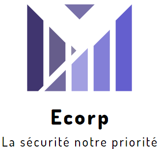
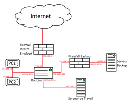

# Ecorp



Ecorp est notre solution que nous vous proposons pour vous protéger contre les attaques de type ransomware. 
(Promo 2023) Projet étudiant en équipe dans le cadre du MasterCamp 2021 à Efrei Paris dans le domaine de la Sécurité et du Réseau, réalisé par : 
- ✨Marine BOUABANH - Gabrielle GIRARD  
- ✨Alexandre DROUET - Fabio VINZIO - Rassoul IDJA 


## Description du projet
---
L’objectif annoncé par ce projet était de protéger les petites entreprises d’une attaque par ransomware. Pour rappel un ransomware est un code malveillant qui chiffre les données d’une entreprise et qui ensuite lui demande de payer de rançon afin de débloquer ces données chiffrées. Ces attaques se font la plupart du temps à travers des mails ou en passant par des sites internet suspects.
Afin de réaliser ce projet, nous avons joué le rôle d’une équipe travaillant pour une entreprise spécialisée dans la sécurité, et une startup vient nous contacter dans le but de se protéger contre ce type de menace. Nous avons donc décidé de découper notre solution en deux parties distinctes : 
-	La première : éviter toute attaque venant des mails frauduleux :
=> consiste à analyser les mails des employés et les prévenir si ceux-ci sont suspects ou non. Cette solution est une méthode préventive au cas où un employé ouvrait un mail contenant un virus. 

-	La seconde : créer un serveur backup permettant de sauvegarder les données d’une entreprise de manière sécurisé :
=> consiste tout simplement à sauvegarder les données des employés, notamment leur travail de la journée, qui pourront seulement être récupérées par le service sécurité de l’entreprise. 
Voici un schéma représentant la topologie de notre réseau :



## Technologie utilisée
---
Ecorp a nécessité, pour sa création, la mise en place d'un réseau local simulé à l'aide de machines virtuelles (sous Oracle). Nous avons donc lancé plusieurs VM représentant : 2 PC, 2 pare-feu, 2 serveurs (travail & backup) et 1 routeur. 

- [Oracle-VirtualBox](https://www.virtualbox.org/) - Utilisation des VMs
- [Nano-linux]() - pour la rédaction de scripts exécutables
- [Python]() - langage de programmation
- [Dillinger](https://dillinger.io/) - éditeur de texte en ligne pour Readme en markdown

## Installation
---
Tout d'abord il faut allumer chacune des machines pour qu'elles puissent être connectées entre elles. (Toutes les configurations du réseau ont été faites au préalable)

1. ##### Partie sauvegarde des données 
Cette partie consiste à sauvegarder les données des employés, depuis le serveur de travail, en archivant leur dossier principal "master" au format "tar.gz" puis en le chiffrant à l'aide du programme "openssl" au format ".dat" et enfin ce dossier chiffré est ensuite envoyé vers le serveur de backup contenant toutes les sauvegardes du jour. L'opération de chiffrement utilise le principe RSA en générant une paire de clés privée/publique. Ainsi, ce processus est exécuté quotidiennement à l'aide d'un script bash selon une plage horaire précise (entre 18h et 21h) grâce au programme "crontab" qui permet également le transfert de fichier d'un serveur à l'autre. Les fichiers vieux de 7 jours sont ensuite supprimés automatiquement.
Pour installer crontab, il suffit de taper :
```sh
apt-get install cron
crontab -e #Pour éditer les actions du fichier crontab.
```
Puis pour exécuter le script, il suffit de taper :
```sh
/ect/init.d/backup-encrypt-daily.sh 
```
2. ##### Partie récupération des données 
Cette partie consiste à récupérer les données sauvegardées des employés, dans le serveur de backup, en déchiffrant le dossier principal "backup-$(date +%Y%m%d)" au format ".dat" à l'aide du programme "openssl" puis en le décompréssant du format ".tar.gz" dans le dossier contenant toutes les sauvegardes du jour. On utilise,de même, le principe RSA avec la paire de clés privée/publique pour le déchiffrement. Ainsi, ce processus est également exécuté quotidiennement à l'aide d'un autre script bash selon la même plage horaire précise avec "crontab". Cependant, pour que tout ceci puisse fonctionner, il est nécessaire de pouvoir s'échanger les clés publiques entre nos deux serveurs. C'est ici que la connexion SSH entre en jeu.
Pour exécuter le script, il suffit de taper :
```sh
/ect/init.d/backup-decrypt-daily.sh 
```
2. ##### Partie connexion sécurisée à distance
Ici on utilise le protocole SSH nous permettant d'établir une communication chiffrée et sécurisée (= tunnel), sur un réseau informatique (intranet) entre une machine locale (le client) et une machine distante (le serveur). Dans notre cas, le serveur de travail jouera le rôle du client tandis que celui de backup jouera celui du serveur. Sachant que par définition, c'est le client qui initie la connexion vers le serveur. De plus, la connexion a lieu seulement si le pare-feu l'autorise avec une règle sur un port particulier.
```sh
sudo apt-get install openssh-server
sudo apt-get install openssh-client
```
Avec Ecorp, la sécurité du chiffrement est assurée par la méthode de cryptographie asymétrique utilisant le principe de clés publique/privée au format ".pem". 
Ainsi, une fois les configuration et la connexion SSH sécurisée effectuée, il n'y a plus qu'à lancer l'opération de transfert via le protocole intégré SFTP.
Pour établir une session, on tape la commande suivante :
```sh
sftp ip_of_remote_serveur 
cd /home/employe #déplacement dans ce rép car par défaut on est dans "/root"
get back_public_key.pem #Transfert du fichier distant vers le système local
```
3. ##### Assurer l'intégrité des données 
Enfin cette partie permet de protéger toutes les données des employés grâce à l'algorithme standard SHA-256 (Secure Hash Algorithm).
On calcule donc, à l'aide d'un script, une empreinte du fichier "base.txt" contenant la liste des identifiants et mots de passe de chaque employé de l'entreprise.
Ensuite dans un autre script, on a la capacité de vérifié si l'empreinte de la personne souhaitant se connecter est identique à celle spécifié au départ.

### Analyse des mails
Pour cette partie voici la procédure que suis notre code : 
1. On se connecte à la boite mail Gmail du client. 
2. Dans la boite mail on se focalise sur l’Inbox (“Boite de réception”) et plus précisément sur les nouveaux mails qui arrivent.  
3. Une fois le mail reçu, nous vérifions sont contenu, savoir si ce dernier contient un ou plusieurs fichiers :
- Si le mail ne contient pas de fichiers, on vérifie s'il contient des url :
- - S'il contient des url on utilise VirusTotal, qui est un site permettant d’analyser des url afin de détecter d’éventuel virus sur le lien de l’url. 
- - En fonction des résultats obtenu par VirusTotal, nous indiquons si le mail reçu est suspect ou non.
- - A la fin de l’analyse, nous envoyons une notification à l’utilisateur pour lui signifier qu’il a reçu un mail et que ce dernier a été analysé

- Si le mail contient un fichier :
- - On analyse le contenu du fichier, et on essaye de voir s’il y a des commandes suspectes, commande servant à hacher ou bien servant à lire et modifier des fichiers.
- - A la fin de l’analyse, nous envoyons une notification à l’utilisateur pour lui signifier qu’il a reçu un mail et que ce dernier a été analysé

**Fin de la documentation**

## License
---
MIT
